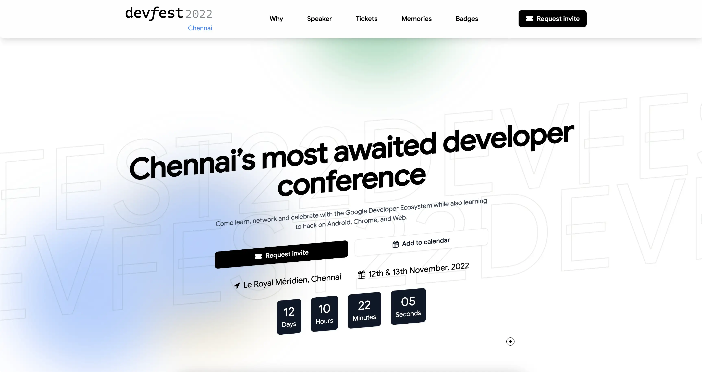

# DevFest Chennai 2023 Wesbite [WIP]



Website for DevFest Chennai 2022 by GDG Chennai

## Technology

This website is built using SvelteKit and TailwindCSS.

## Deployment

Auto Deployed with Cloudflare Pages.

### Deployment steps

* Build Command: `npm run build`
* Build output directory: `/.svelte-kit/cloudflare`
* Root directory: `/`

## Development

Follow these steps to locally setup this project.

```bash
npm install
npm run dev
```

## Contributors

<!-- ALL-CONTRIBUTORS-BADGE:START - Do not remove or modify this section -->
[](#contributors-)
<!-- ALL-CONTRIBUTORS-BADGE:END -->


<!-- ALL-CONTRIBUTORS-LIST:START - Do not remove or modify this section -->
<!-- prettier-ignore-start -->
<!-- markdownlint-disable -->
<table>
  <tbody>
    <tr>
      <td align="center" valign="top" width="14.28%"><a href="https://navs.page"><br /><sub><b>Naveen S</b></sub></a><br /><a href="#maintenance-navhits" title="Maintenance">🚧</a> <a href="https://github.com/gdgchennai/devfest2022-web/commits?author=navhits" title="Code">💻</a> <a href="https://github.com/gdgchennai/devfest2022-web/commits?author=navhits" title="Documentation">📖</a> <a href="https://github.com/gdgchennai/devfest2022-web/pulls?q=is%3Apr+reviewed-by%3Anavhits" title="Reviewed Pull Requests">👀</a></td>
      <td align="center" valign="top" width="14.28%"><a href="https://www.thisux.in"><br /><sub><b>Sanju S</b></sub></a><br /><a href="https://github.com/gdgchennai/devfest2022-web/commits?author=Spikeysanju" title="Code">💻</a> <a href="#design-Spikeysanju" title="Design">🎨</a> <a href="#infra-Spikeysanju" title="Infrastructure (Hosting, Build-Tools, etc)">🚇</a></td>
      <td align="center" valign="top" width="14.28%"><a href="http://abhishekmishra.dev"><br /><sub><b>Abhishek Mishra</b></sub></a><br /><a href="https://github.com/gdgchennai/devfest2022-web/pulls?q=is%3Apr+reviewed-by%3Aabhishekmishragithub" title="Reviewed Pull Requests">👀</a> <a href="#ideas-abhishekmishragithub" title="Ideas, Planning, & Feedback">🤔</a></td>
      <td align="center" valign="top" width="14.28%"><a href="https://trishiraj.me/"><br /><sub><b>Trishiraj</b></sub></a><br /><a href="#projectManagement-StarkDroid" title="Project Management">📆</a> <a href="https://github.com/gdgchennai/devfest2022-web/commits?author=StarkDroid" title="Code">💻</a> <a href="https://github.com/gdgchennai/devfest2022-web/pulls?q=is%3Apr+reviewed-by%3AStarkDroid" title="Reviewed Pull Requests">👀</a> <a href="#maintenance-StarkDroid" title="Maintenance">🚧</a></td>
      <td align="center" valign="top" width="14.28%"><a href="https://github.com/namruthahari"><br /><sub><b>Namrutha</b></sub></a><br /><a href="#content-namruthahari" title="Content">🖋</a></td>
      <td align="center" valign="top" width="14.28%"><a href="https://iamimmanuelraj.github.io/"><br /><sub><b>Immanuel Raj</b></sub></a><br /><a href="#content-iamimmanuelraj" title="Content">🖋</a> <a href="https://github.com/gdgchennai/devfest2022-web/pulls?q=is%3Apr+reviewed-by%3Aiamimmanuelraj" title="Reviewed Pull Requests">👀</a></td>
      <td align="center" valign="top" width="14.28%"><a href="https://github.com/iamaravindsekar"><br /><sub><b>Aravind Sekar</b></sub></a><br /><a href="#design-iamaravindsekar" title="Design">🎨</a></td>
    </tr>
    <tr>
      <td align="center" valign="top" width="14.28%"><a href="https://ahamedbasha-n.github.io/portfolio/"><br /><sub><b>Ahamed Basha N </b></sub></a><br /><a href="#maintenance-ahamedbasha-n" title="Maintenance">🚧</a></td>
      <td align="center" valign="top" width="14.28%"><a href="https://github.com/SikandarJODD"><br /><sub><b>Sikandar Bhide</b></sub></a><br /><a href="https://github.com/gdgchennai/devfest2022-web/commits?author=SikandarJODD" title="Code">💻</a></td>
      <td align="center" valign="top" width="14.28%"><a href="https://github.com/nammahari"><br /><sub><b>HARI PRASANTH S</b></sub></a><br /><a href="https://github.com/gdgchennai/devfest2022-web/commits?author=nammahari" title="Code">💻</a></td>
      <td align="center" valign="top" width="14.28%"><a href="http://moaqz.tech"><br /><sub><b>Mateo Gonzalez</b></sub></a><br /><a href="https://github.com/gdgchennai/devfest2022-web/commits?author=moaqz" title="Code">💻</a></td>
    </tr>
  </tbody>
</table>

<!-- markdownlint-restore -->
<!-- prettier-ignore-end -->

<!-- ALL-CONTRIBUTORS-LIST:END -->
<!-- prettier-ignore-start -->
<!-- markdownlint-disable -->

<!-- markdownlint-restore -->
<!-- prettier-ignore-end -->

<!-- ALL-CONTRIBUTORS-LIST:END -->

## License

This project uses [MIT](LICENSE.txt) license.
